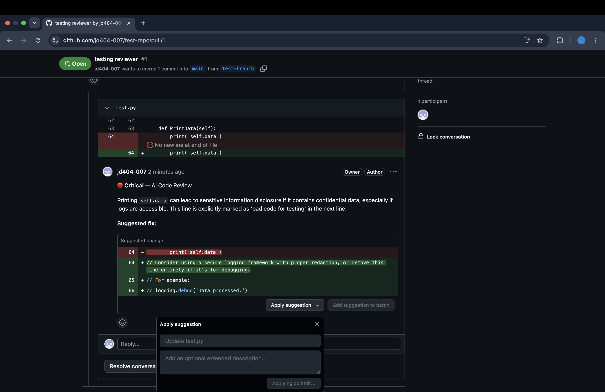

# 🤖 AI Code Reviewer

> An AI-powered GitHub Pull Request review agent that automatically posts **inline security findings** and **one-click fix suggestions** the moment a PR is opened or updated.

---

## 📽 Demo

[](https://drive.google.com/file/d/1AWCNo_E3JkTHHJT7o8rMsd5bh20pST2h/view?usp=sharing)

---

## 🔍 Preview

![AI Code Reviewer in action]



*Live example: the agent flagging a critical data-exposure bug on line 64 of `test.py`, with a one-click suggested fix posted directly inside the GitHub PR diff view.*

---

## 🎯 Overview

AI Code Reviewer is a GitHub webhook agent built with TypeScript, Express, and Google Gemini. It listens for `pull_request` events, fetches the diff, and has Gemini perform a security-focused review — then posts the findings back to GitHub as native inline comments with `suggestion` blocks that can be applied in a single click.

The entire pipeline runs asynchronously: GitHub receives a `202 Accepted` immediately, while the review happens in the background with no timeout risk.

---

## ✨ What It Does

| Step | What happens |
|------|-------------|
| **1. Webhook received** | GitHub fires a `pull_request` event (opened / synchronize) to the agent's `/webhook` endpoint |
| **2. Signature verified** | Every request is validated with HMAC-SHA256 against `GITHUB_WEBHOOK_SECRET` |
| **3. Diff fetched** | The PR diff is pulled via the GitHub API; lock files, minified bundles, and generated files are filtered out |
| **4. AI review** | The cleaned diff is sent to Gemini with a security-focused prompt that returns a structured JSON array of findings |
| **5. Comments posted** | Each finding becomes an inline GitHub comment with a ` ```suggestion ` block and a severity label |
| **6. Summary posted** | A top-level review comment summarises all findings in a severity table |

---

## 🚀 Quick Connect — Live Deployment

The agent is already deployed and publicly reachable. To use it on any GitHub repository, register the webhook below:

> **Repo → Settings → Webhooks → Add webhook**

| Field | Value |
|-------|-------|
| **Payload URL** | `https://ai-code-reviewer-production-3d67.up.railway.app/webhook` |
| **Content type** | `application/json` |
| **Secret** | `mysecretangelsofiaprincess123@` |
| **Events** | Pull requests only (`pull_request`) |

Once registered, open a PR on that repo — inline review comments will appear within ~20 seconds.

**Endpoints:**

| | URL |
|--|--|
| Health check | `https://ai-code-reviewer-production-3d67.up.railway.app/health` |
| Webhook | `https://ai-code-reviewer-production-3d67.up.railway.app/webhook` |

---

## 🔄 Pipeline Architecture

```
GitHub PR opened / updated
          │
          ▼
  POST /webhook
  ┌─────────────────────────────────────┐
  │  Verify HMAC-SHA256 signature        │
  │  Validate payload schema (zod)       │
  │  Respond 202 immediately             │
  └──────────────┬──────────────────────┘
                 │  fire-and-forget async pipeline
                 ▼
  ┌─────────────────────────────────────┐
  │  fetchAndParseDiff()                 │
  │  • Octokit pulls.get (diff format)   │
  │  • parse-diff → structured chunks   │
  │  • Filter noise (lock files, etc.)   │
  └──────────────┬──────────────────────┘
                 ▼
  ┌─────────────────────────────────────┐
  │  reviewDiff()                        │
  │  • Format diff as "Line N: <code>"   │
  │  • Gemini API with JSON schema       │
  │  • Defensive parse & validation      │
  └──────────────┬──────────────────────┘
                 ▼
  ┌─────────────────────────────────────┐
  │  postReviewComments()                │
  │  • Build inline suggestion blocks   │
  │  • Build severity summary table     │
  │  • pulls.createReview (single call)  │
  └──────────────┬──────────────────────┘
                 ▼
     PR updated with inline comments
```

---

## 🛠 Tech Stack

| Layer | Technology |
|-------|-----------|
| Runtime | Node.js 18+ / TypeScript (ESM) |
| Server | Express + `express.raw()` |
| GitHub API | `@octokit/rest` + `@octokit/webhooks` |
| AI Model | Google Gemini `gemini-2.0-flash` via `@google/genai` |
| Diff Parser | `parse-diff` |
| Schema Validation | `zod` |
| Testing | Vitest + Supertest |
| Deployment | Railway |

> **ESM-only project** — `@octokit/rest` and `@octokit/webhooks` are ESM-only packages. The project uses `"type": "module"` in `package.json`, `"module": "NodeNext"` in `tsconfig.json`, and `.js` extensions on all TypeScript imports. Do not use `require()` anywhere.

---

## 📁 Project Structure

```
src/
├── index.ts        — Entry point, starts Express server
├── webhook.ts      — Receives & verifies GitHub webhook
├── github.ts       — Fetches PR diff via Octokit, parses with parse-diff
├── reviewer.ts     — Sends diff to Gemini, parses structured response
├── formatter.ts    — Formats findings as GitHub review comments
└── types.ts        — Shared TypeScript interfaces

tests/
├── fixtures/
│   └── sample.diff             — Real diff with intentional security issues
├── webhook.test.ts             — HMAC verification, payload validation   (8 tests)
├── github.test.ts              — Diff parsing, file filtering            (35 tests)
├── reviewer.test.ts            — Prompt parsing, edge cases              (19 tests)
├── formatter.test.ts           — Comment format, suggestion blocks       (19 tests)
└── e2e.test.ts                 — Full pipeline integration               (10 tests)
```

---

## ⚙️ Local Setup

### 1. Clone and install

```bash
git clone https://github.com/jd404-007/ai-code-reviewer
cd ai-code-reviewer
npm install
```

### 2. Configure environment variables

```bash
cp .env.example .env
```

```env
GITHUB_TOKEN=ghp_...           # Personal Access Token with `repo` scope
GITHUB_WEBHOOK_SECRET=...      # Any random string — must match your webhook config exactly
GEMINI_API_KEY=...             # From aistudio.google.com
PORT=3000
```

**Getting a GitHub Token:**
Settings → Developer settings → Personal access tokens → Tokens (classic) → check `repo` scope.

**Getting a Gemini API Key:**
[aistudio.google.com](https://aistudio.google.com) → *Get API key* → Create API key.

### 3. Run locally

```bash
npm run dev
# Server:   http://localhost:3000
# Webhook:  http://localhost:3000/webhook
# Health:   http://localhost:3000/health
```

### 4. Expose with ngrok for webhook testing

GitHub needs a public HTTPS URL to deliver events. ngrok tunnels your localhost:

```bash
# Install (macOS)
brew install ngrok

# Authenticate (free tier is sufficient)
ngrok config add-authtoken YOUR_AUTHTOKEN

# In a separate terminal
ngrok http 3000
# Forwarding  https://xxxx.ngrok-free.app -> http://localhost:3000
```

Register `https://xxxx.ngrok-free.app/webhook` as your GitHub webhook using the same value as `GITHUB_WEBHOOK_SECRET`. Open a PR and watch inline comments appear within seconds.

---

## 🧪 Running Tests

```bash
npm test                                    # all tests
npx vitest run tests/e2e.test.ts            # end-to-end pipeline only
npx vitest --watch                          # watch mode during development
```

---

## 🔧 Troubleshooting

| Symptom | Cause & Fix |
|---------|-------------|
| `Invalid signature` on webhook | `GITHUB_WEBHOOK_SECRET` must be byte-for-byte identical to the value in GitHub's webhook settings |
| No comments on PRs | Likely an expired `GITHUB_TOKEN` — regenerate at github.com/settings/tokens |
| `ERR_REQUIRE_ESM` | Ensure `"type": "module"` in `package.json` and `"module": "NodeNext"` in `tsconfig.json`. Node.js 18+ required |
| Gemini `could not be parsed` | Diff likely hit the model's token limit — split large PRs into smaller focused commits |